## Part 1. Установка ОС
- Скачаиваем образ с официального сайта Ubunutu https://ubuntu.com/download/server/armhttps://ubuntu.com/download/server/arm
- Устанавливаем на виртуальную машину Ubuntu 20.04 Server LTS без графического интерфейса
- Проверем всерию Ubuntu командой `cat /etc/issue`
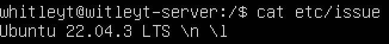

## Part 2. Создание пользователя
 - Создаём нового пользователя командой командой `sudo adduser new_cool_whitleyt`
 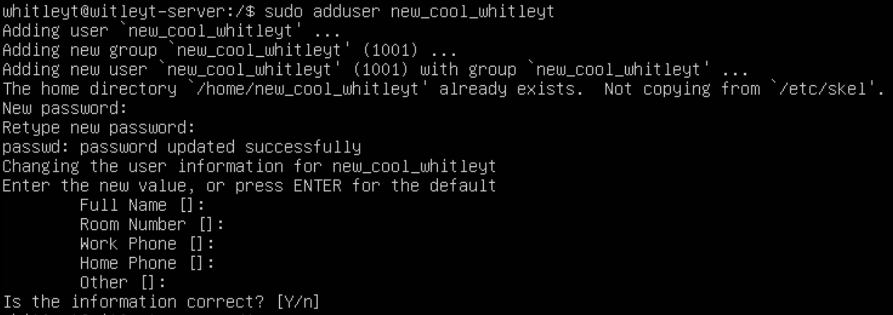
 
 - Добавляем пользователя в группу adm командой `sudo usermod -a -G adm new_cool_whitleyt`
  

- Проверяем что пользователь был действительно создан команддой `cat /etc/passwd`
 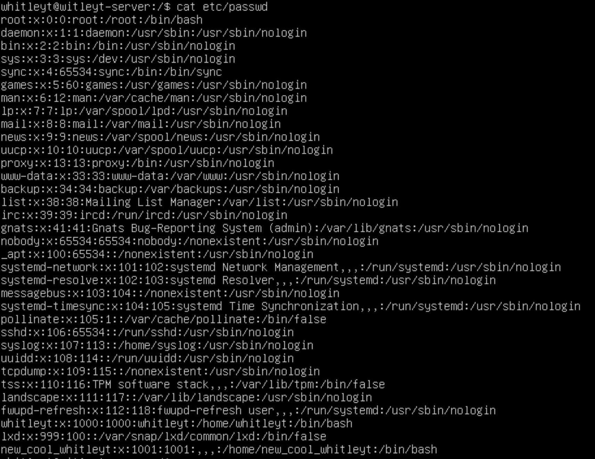

## Part 3. Настройка сети ОС
- Изменяем название машины на user-1 с помощью команды `hostnamectl set-hostname user-1`
 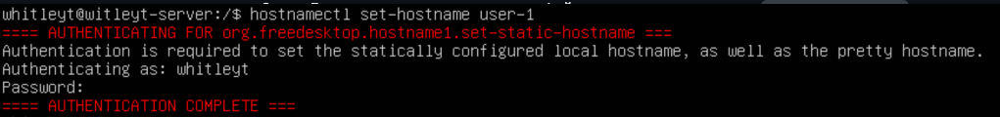

- Перезагружаем машину, чтобы изменения вступили в силу командой `sudo reboot`
- Проверяем название машины `cat /etc/hostname`
 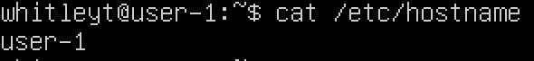
 
- Проверяем текущий часовой пояс `timedatectl`
 
 
- Выставляем нужный часовой пояс командой `sudo timedatectl set-timezone Asia/Novosibirsk`

- Проверяем часовой пояс
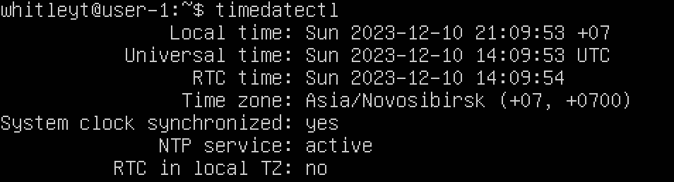

- Вывод названия сетевых интерфейсов с помощью команды `ls /sys/class/net`
 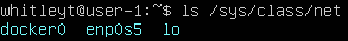

* docker0 -это сетевой интерфейс, который создается Docker при установке. Он представляет собой мост (bridge), который используется для связи контейнеров Docker с внешней сетью, а также для обеспечения их связи друг с другом.

* enp0s5 -  сетевой интерфейс, в котором. en обозначает Ethernet (проводное подключение). p0 обозначает порт (port). s5 обозначает слот (slot).

* lo - Он используется для отладки сетевых программ и запуска серверных приложений на локальной машине. С этим интерфейсом всегда связан адрес 127.0.0.1. У него есть dns-имя – localhost.

- С помощью команды `ip r` получаем ip адрес устройства, на котором мы работаем, от DHCP сервера.
 

- Dynamic Host Configuration Protocol (DHCP) - это протокол управления сетью, используемый в сетях TCP/IP, в котором DHCP-сервер динамически присваивает каждому устройству IP-адрес и другие параметры сетевой конфигурации, чтобы они могли связываться с другими IP-сетями.

- Выводим внешний(ip) и внутренний(gw) ip-адреса шлюза командами `wget -q -O - inconfig.me/ip` и `ip route | grep default`
 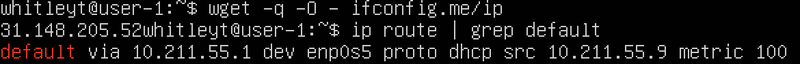

- Задаем статичные настройки ip, gw, dns командой sudo nano /etc/resolv.conf
 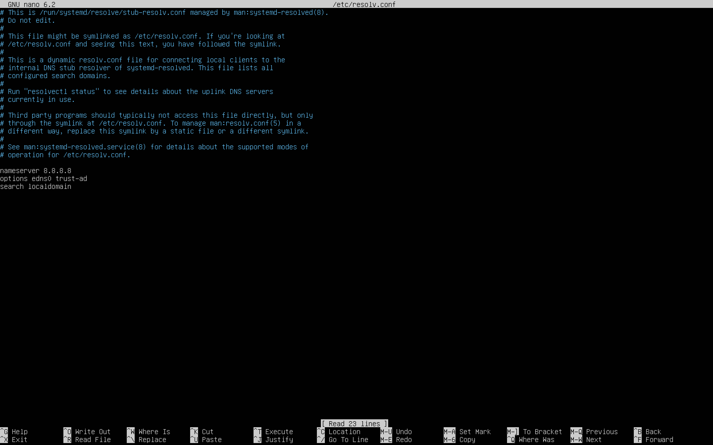

- Перезагружаем машину для внесения изменений командой `sudo reboot`
- Проверяем, что статичные сетевые настройки (ip, gw, dns) соответствуют данным, командой `ping -c 8 1.1.1.1 && ping -c 8 ya.ru`
 

## Part 4. Обновление ОС

- Узнаём колличество пакетов командой `sudo apt update`, обновляем пакеты командой `sudo apt full-upgrade` и проверяем обновления командой `sudo do-release-upgrade` 
 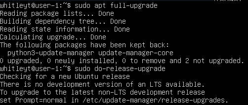
 
 ## Part 5. Использование команды sudo

- Разрешаем пользователю new_cool_whitleyt, созданному в Part 2, выполнять команду sudo командой `sudo usermod -a -G sudo new_cool_whitleyt`
 

- Переключаемся на пользователя su - new_cool_whitleyt `su - new_cool_whitleyt`
 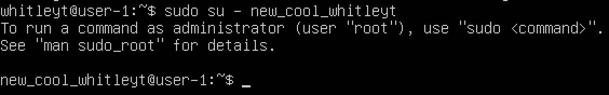
 
- Изменяем hostname и проверяем изменения от добавленного пользователя `sudo hostname big-power`
 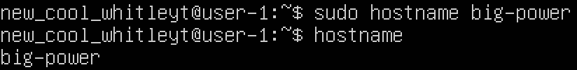

## Part 6. Установка и настройка службы времени

- Выведим в терминал дату и время с NTPSynchronized=yes при помощи команды `timedatectl show`
 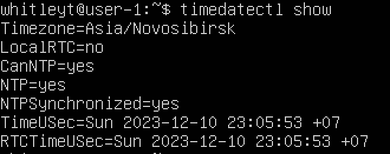

## Part 7. Установка и использование текстовых редакторов

1. Скачаиваем текстовый редактор MCEDIT командой `sudo apt install mc`
2. Создаём и редактируем файл с сохранением изменений:
- VIM: создаем файл с помощью команды `vim test_vim.txt`
- Нажимаем на "i" в редакторе, для редактирования
- Пишем свой ник: "whitleyt"
- Для выхода с сохранением используем команды: `Esc`, `:wq`, `Enter`
 
- NANO: создаем файл с помощью команды `nano test_nano.txt`
- Пишем свой ник: "whitleyt"
- Для выхода с сохранением используем команды: `ctrl+o`, `Enter`, `ctr+x`
 
- MCEDIT: создаем файл с помощью команды `mcedit test_mcedit.txt`
- Пишем свой ник: "whitleyt"
- Для выхода с сохранением используем команды: `fn+F2`, `Enter`, `fn+F10`
 
3. Редактирование файла с заменой слова без сохранения изменений:
- VIM: открываем файл с помощью команды `vim test_vim.txt`
- Нажимаем на "i" в самом редакторе, для редактирования
- Изменяем "whitleyt" на "21 School 21"
- Для выхода без сохранения используем команды: `Esc`, `:q!`, `Enter`
 
- NANO: открываем файл с помощью команды `nano test_nano.txt`
- Изменяем "whitleyt" на "21 School 21"
- Для выхода без сохранения используем команды: `ctrl+x`, `N`, `Enter`
 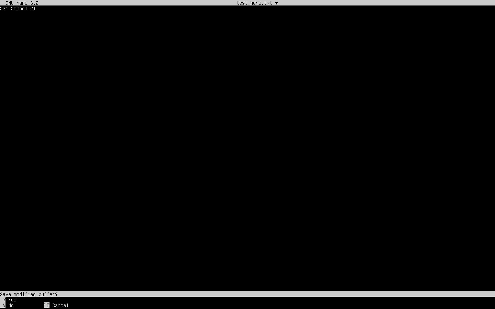
- MCEDIT: открываем файл с помощью команды `mcedit test_mcedit.txt`
- Изменяем "whitleyt" на "21 School 21"
- Для выхода без сохранения используем команды: fn+F10, No, Enter
 
4. Редактирование файла с поиском и заменой слова:
- VIM: открываем файл с помощью команды `vim test_vim.txt`
- Для поиска в VIM вводим `/ley` и искомое слово выделяется в самом редакторе
 
- Для замены слова в VIM вводим `:%s/whitleyt/21 School 21` и слово "whitleyt" заменяется на "21 School 21"
 
 
 
- NANO: открываем файл с помощью команды `nano test_nano.txt`
- Для поиска в NANO вводим `ctrl+W`
 
 Для замены слова в NANO вводим `ctrl+\`, пишем "whitleyt", нажимаем Enter, пишем "21 School 21", нажимаем `Enter`, выбираем `Y`
 
  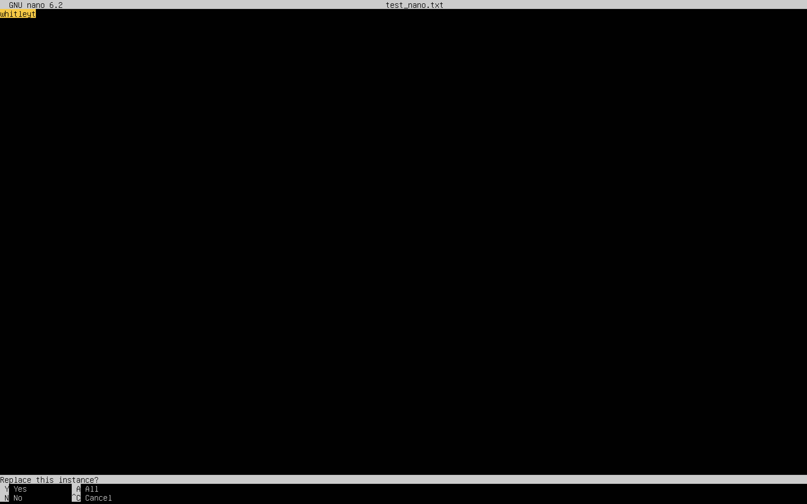
   
   
- MCEDIT: открываем файл с помощью команды `mcedit test_mcedit.txt`
- Для поиска в MCEDIT вводим `fn+F7`, вводим слово, которое хотим найти, нажимаем Enter
   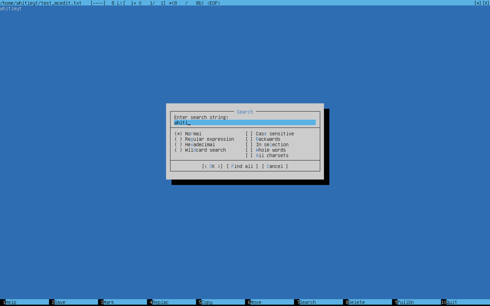
- Для замены слова в MCEDIT вводим `fn+F4` пишем "whitleyt", нажимаем на клавишу "стрелка вниз", пишем "21 School 21", нажимаем `Enter`, выбираем Replace
   
      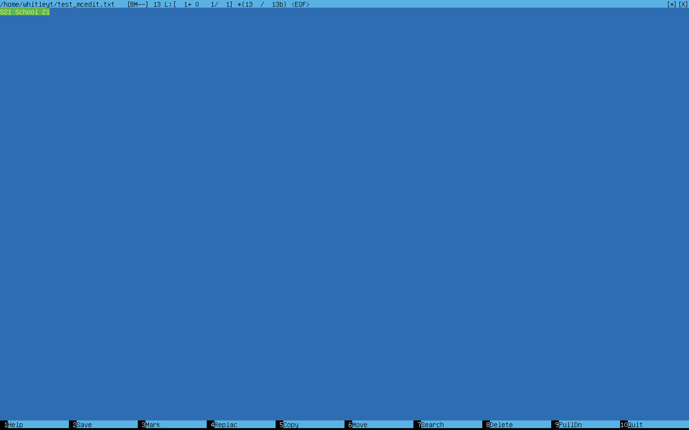
## Part 8. Установка и базовая настройка сервиса SSHD
1. Устанавливаем службу SSHd командой `sudo apt install openssh-server`
 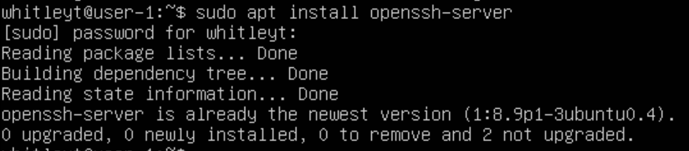
2. Добавляем автостарт службы SSHd командой `sudo update-rc.d ssh defaults`
 
3. Изменяем порт SSHd в фале `sudo vim /etc/ssh/sshd_config` Заменяем #Port 22 на #Port 2022.
 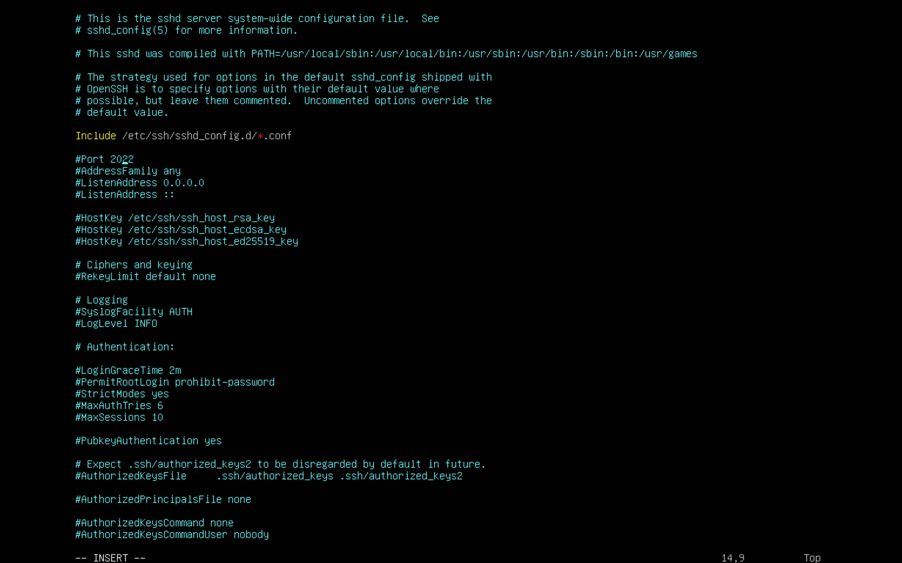
- Перезапускаем SSHd для внесения изменений `/etc/init.d/ssh restart`
 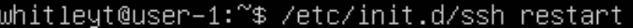
4. Проверяем наличие процесса SSHd командой ps -axfv | grep sshd
 
- Команда ps выводит список текущих процессов на вашем сервере. Используется обычно в сочетании с командой grep
- Флаги: 
    * -a: Выбирает все процессы, кроме лидеров сеансов и процессов, не связанных с терминалом. 
    * -x: Заставляет ps отображать список всех процессов, которыми вы владеете (тот же EUID, что и у ps), или перечислять все процессы при использовании вместе с опцией a 
    * -f: Выводит полноформатный список 
    * -v: Выводит информацию о версии 
5. Устанавливаем net-tools `sudo apt install net-tools`
 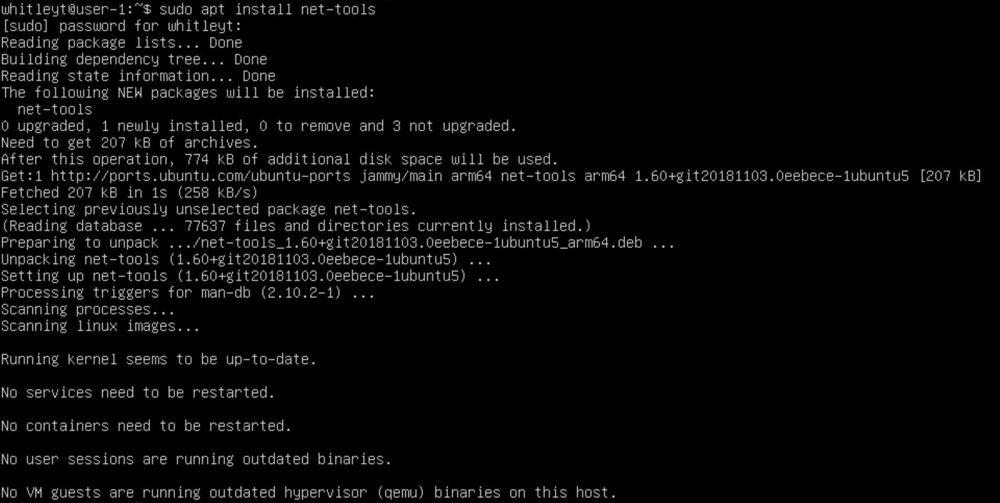
- Выполняем команду `netstat -tan`
 
Опция -a показывает состояние всех сокетов; -n показывает ip адрес, а не сетевое имя; -t показывает только tcp соединения.
- Значения столбцов: 
    * Proto - протокол, используемый сокетом; 
    * Recv-Q - количество байтов, не скопированных пользовательской программой, подключенной к этому сокету; 
    * Local Address - локальный адрес (имя локального хоста) и номер порта сокета; 
    * Foreign Address - удаленный адрес (имя удаленного хоста) и номер порта сокета; 
    * State - состояние сокета; 
    * 0.0.0.0 в этом контексте означает "все IP-адреса на локальной машине". 
- Перезагружаем систему командой `sudo reboot`
