# Сети в Linux

## Part 1. Инструмент **ipcalc**

### 1.1 Сети и маски

#### 1) Адрес сети `192.167.38.54/13`

```bash
Исходный IP адрес
192.167.38.54/13
В бинарном формате
11000000.10100111.00100110.00110110
Исходная маска сети
11111111.11111000.00000000.00000000
255.248.0.0
Совершаем операцию AND между ip адресом и маской подсети
11000000.10100000.00000000.00000000
Переводим в decimal
192.160.0.0
```

#### 2) Перевод маски `255.255.255.0` в префиксную и двоичную запись, `/15` в обычную и двоичную, `11111111.11111111.11111111.11110000` в обычную и префиксную

```bash
decima 255.255.255.0
prefix /24
binary 11111111.11111111.11111111.00000000

decima 255.254.0.0
prefix /15
binary 11111111.11111110.00000000.00000000

decimal 255.255.255.240
prefix /28
binary 11111111.11111111.11111111.11110000
```

#### 3) Минимальный и максимальный хост в сети `12.167.38.4` при маске `/8`

```bash
prefix /8
ip dec 12.167.38.4       = binary 00001100.10100111.00100110.00000100
mask dec 255.0.0.0       = binary 11111111.00000000.00000000.00000000
host min 12.0.0.1        = binary 00001100.00000000.00000000.00000001
host max 12.255.255.254  = binary 00001100.11111111.11111111.1111110

Количество доступных адресов:
2^24 = 16777214 - 2 = 16777212
```

`11111111.11111111.00000000.00000000`

```bash
prefix /16
ip dec 12.167.38.4       = binary 00001100.10100111.00100110.00000100
mask dec 255.255.0.0     = binary 11111111.11111111.00000000.00000000
host min 12.167.0.1      = binary 00001100.10100111.00000000.00000001
host max 12.167.255.254  = binary 00001100.10100111.11111111.1111110
Количество доступных адресов:
2^16 = 65536 - 2 = 65534
```

`255.255.254.0`

```bash
prefix /23
ip dec 12.167.38.4       = binary 00001100.10100111.00100110.00000100
mask dec 255.255.254.0   = binary 11111111.11111111.11111110.00000000
host min 12.167.38.1     = binary 00001100.10100111.00100110.00000001
host max 12.255.38.254   = binary 00001100.10100111.00100110.1111110
Количество доступных адресов:
2^9 = 512 - 2 = 510
```

`/4`

```bash
prefix /4
ip dec 12.167.38.4      = binary 00001100.10100111.00100110.00000100
mask dec 240.0.0.0      = binary 11110000.00000000.00000000.00000000
host min 0.0.0.1        = binary 00000000.00000000.00000000.00000001
host max 15.255.255.254 = binary 00001111.11111111.11111111.11111110
Количество доступных адресов:
2^28 = 268435456 - 2 = 268435454
```

### 1.2 localhost

#### Определить и записать в отчёт, можно ли обратиться к приложению, работающему на localhost, со следующими IP

`localhost («местный» от англ. local — этот компьютер) — стандартное, официально зарезервированное доменное имя для частных IP-адресов в диапазоне 127.0.0.1 — 127.255.255.254`

```bash
194.34.23.100 - нет доступа
127.0.0.2     - есть
127.1.0.1     - есть
128.0.0.1     - нет доступа
```

### 1.3 Диапазоны и сегменты сетей

`Privat(частные или серые) IPv4:
10.0.0.0 - 10.255.255.255 (/8)
172.16.0.0 - 172.31.255.255 (/12)
192.168.0.0 - 192.168.255.255 (/16)
За исключением адресов, указанных выше, публичные(Public) IP-адреса варьируются от 1 до 191.`

#### Определить и записать в отчёт

#### 1) какие из перечисленных IP можно использовать в качестве публичного, а какие только в качестве частных

```bash
10.0.0.45      - Private
134.43.0.2     - Public
192.168.4.2    - Private
172.20.250.4   - Private
172.0.2.1      - Public
192.172.0.1    - Public
172.68.0.2     - Public
172.16.255.255 - Private
10.10.10.10    - Private
192.169.168.1  - Public
```

#### 2) какие из перечисленных IP адресов шлюза возможны у сети `10.10.0.0/18`

HostMin 10.10.0.1 HostMax 10.10.63.254

```bash
10.0.0.1    - out of range
10.10.0.2   - ok
10.10.10.10 - ok
10.10.100.1 - out of range
10.10.1.255 - ok
```

## Part 2. Статическая маршрутизация между двумя машинами

- ```ip a (ws1, ws2)```  

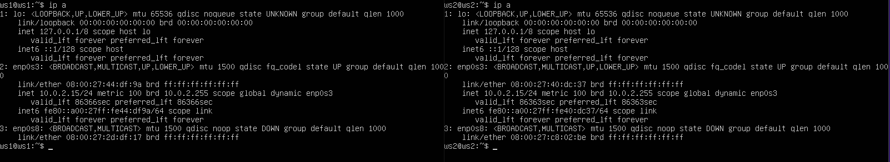  

- Опиши сетевой интерфейс, соответствующий внутренней сети, на обеих машинах и задать следующие адреса и маски: ws1 192.168.100.10, маска /16, ws2 - 172.24.116.8, маска /12.

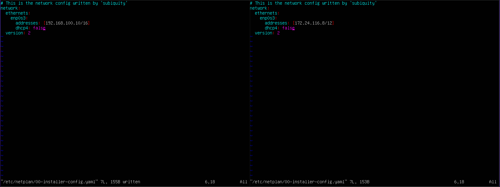  

- Выполни команду ```netplan apply``` для перезапуска сервиса сети.

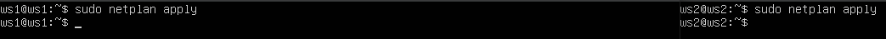  

### 2.1. Добавление статического маршрута вручную

- Команды для добаления статического маршрута, пинг

  

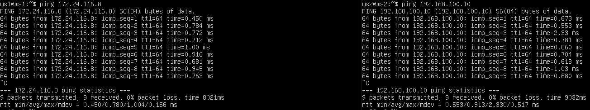  

### 2.2. Добавление статического маршрута вручную

- Добавь статический маршрут от одной машины до другой и обратно при помощи команды вида ip r add.

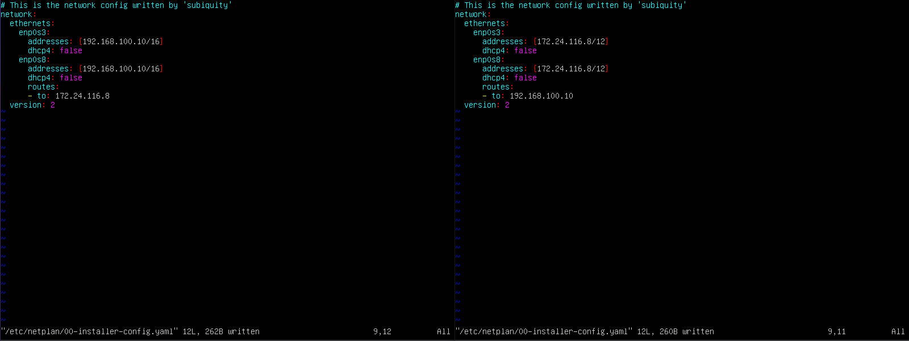  

- Повторный пинг

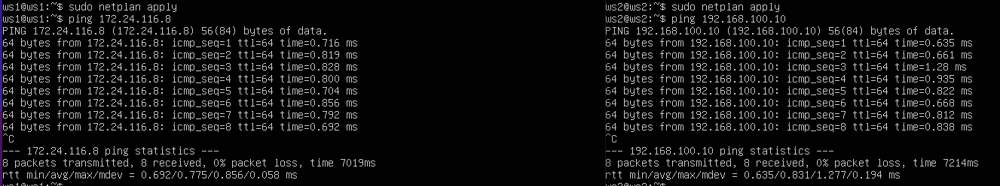  

## Part 3. Утилита iperf3

### 3.1. Скорость соединения

- 8 Mbps = 1 MB/s
- 100 MB/s = 819200 Kbps
- 1 Gbps = 1024 Mbps

### 3.2. Утилита iperf3  

- Проверяем скорость соеденения  

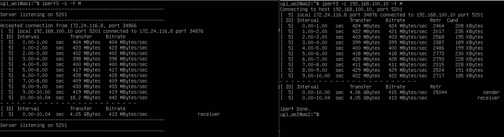  

## Part 4. Сетевой экран  

### 4.1. Утилита iptables  

- Добавим правила по пути ```/etc/firewall.sh```  

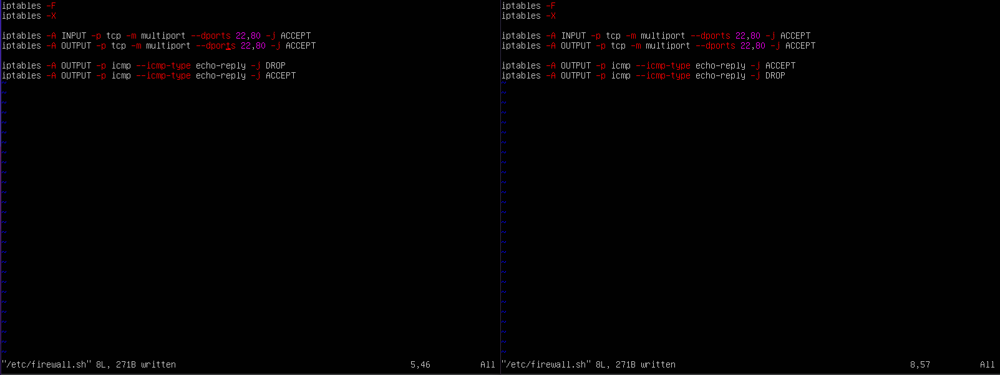  

- Даём фалу разрешение на исполнение и запускаем  

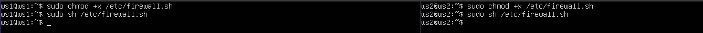  

### 4.2 Утилита nmap  

- Пропинговываем машины и видим, что ws1 не пингуется

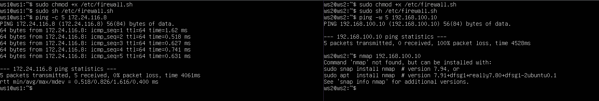  

- При этом из nmap видим что ws1 запущено  

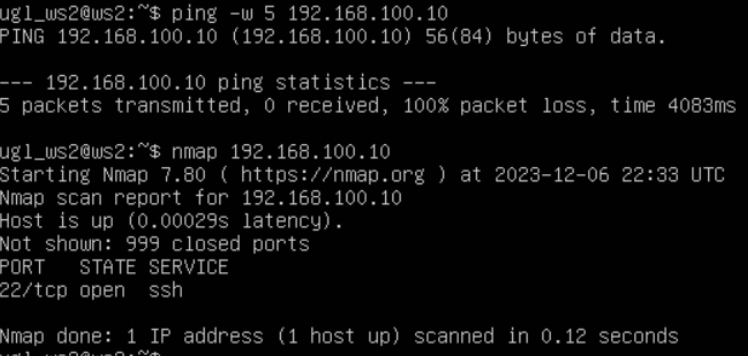  

## Part 5. Статическая маршрутизация сети

### 5.1. Настройка адресов машин  

- Поднимаем 5 виртуальных машин и в соответствии с сетевой схемой настраиваем их сетевые интерфейсы  

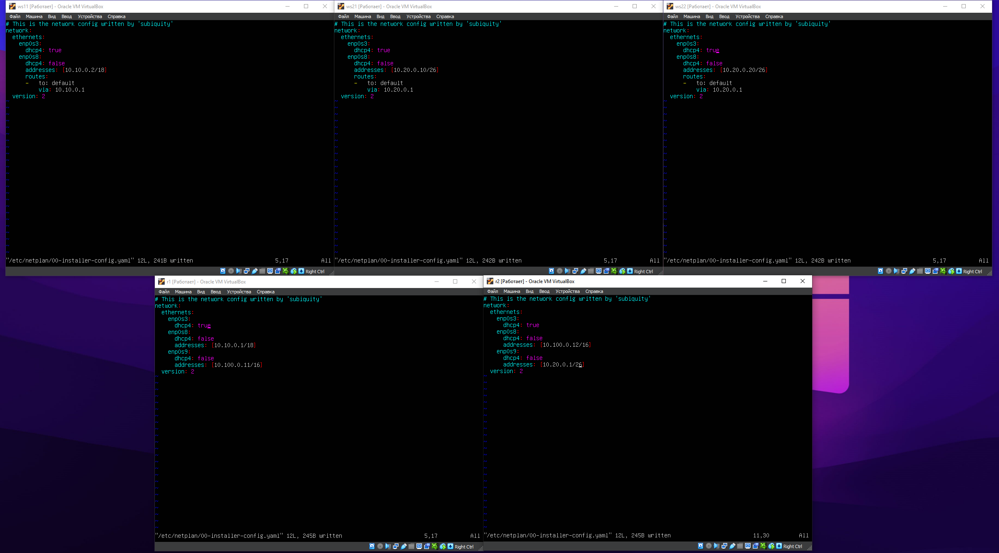  

- ```ip -4 a``` на всех машинах  

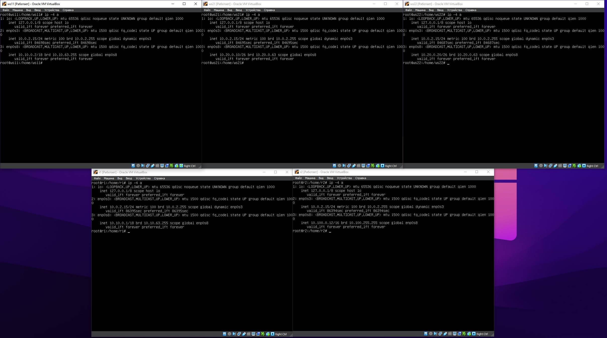  

- Пропингуем с ws22 на ws21

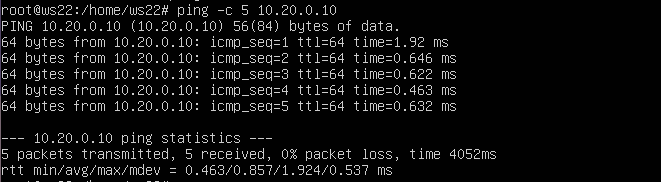  

- Пропингуем с r1 на ws11

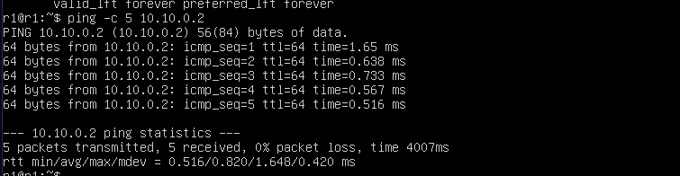  

### 5.2. Включение переадресации IP-адресов

- Включаем переадресацию во время сеанса на роутерах ```sysctl -w net.ipv4.ip_forward=1```  

  

- Включаем статическую переадресацию

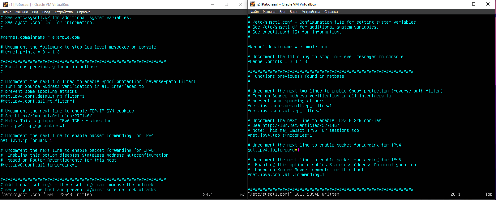  

### 5.3. Установка маршрута по-умолчанию  

- Поставим default на всех машинах  

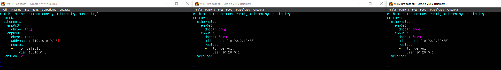  

- ```ip r``` на всех машинах  

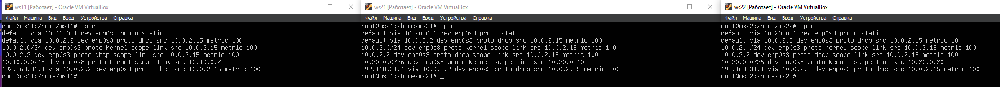  

- Пингуем с ws11 на r2, на r2 выполнена команда ```tcpdump -tn enp0s8```  

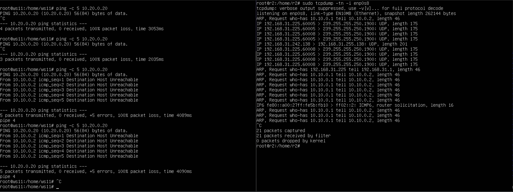  

### 5.4. Добавление статических маршрутов  

- Добавим  маршруты в r1 и r2

  

- ```ip r``` на обеих машинах  

  

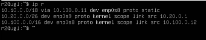  

- Выполним команду ```ip r list```  

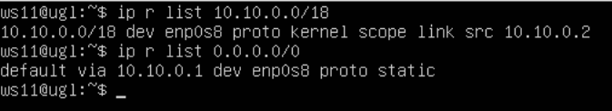  

- Потому что маршрут по умолчанию выбирается только в том случае, если нет других маршрутов, заданных вручную. При наличии нескольких маршрутов, выбирается тот у которого больше значение маски подсети, а значит адрес с маской 0 не будет выбран, если есть другой.  

## 5.5. Построение списка маршрутизаторов  

- Включаем на роутере по номером 1 команду tcpdump

- Запустить на r1 команду дампа:  

- ```tcpdump -tnv -i eth0```  

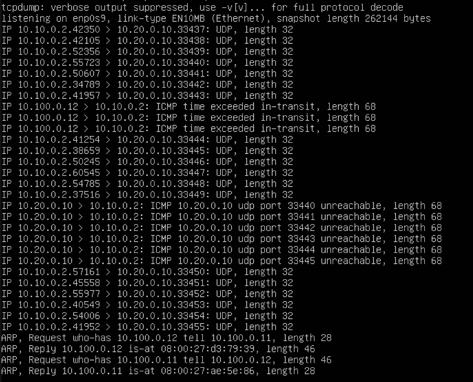  

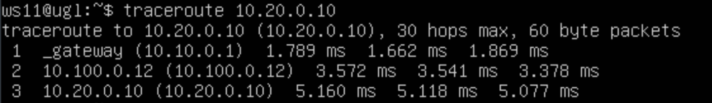  

- Был построен маршрут от машины ws11 до машины ws21, которая находится в другой локальной сети. Как видно на скриншоте сначала машина ws11(10.10.0.2) соединяется по протоколу UDP со своим роутером r1(10.10.0.1), затем роутер r1 по протоколу ICMP передает сообщение другому роутеру r2(10.100.0.12), который в свою очередь связывается по протоколу UDP с машиной ws21(10.20.0.10)

## 5.6. Использование протокола ICMP при маршрутизации  

- Пингуем несуществующий ip адресс. Видим что tcmp на r1 показывает "unreachable" при попытке направить трафик с r1.  

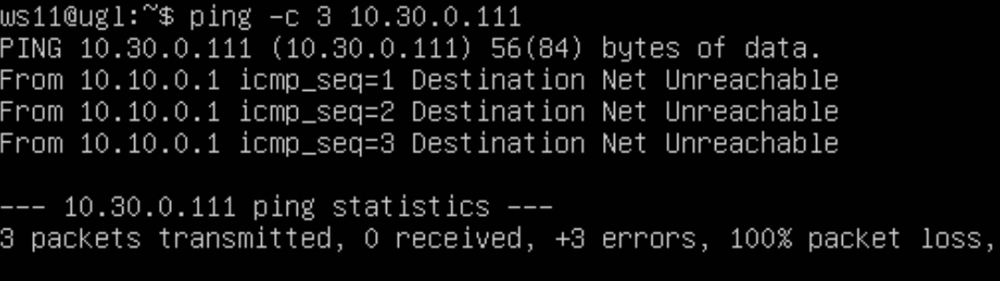  

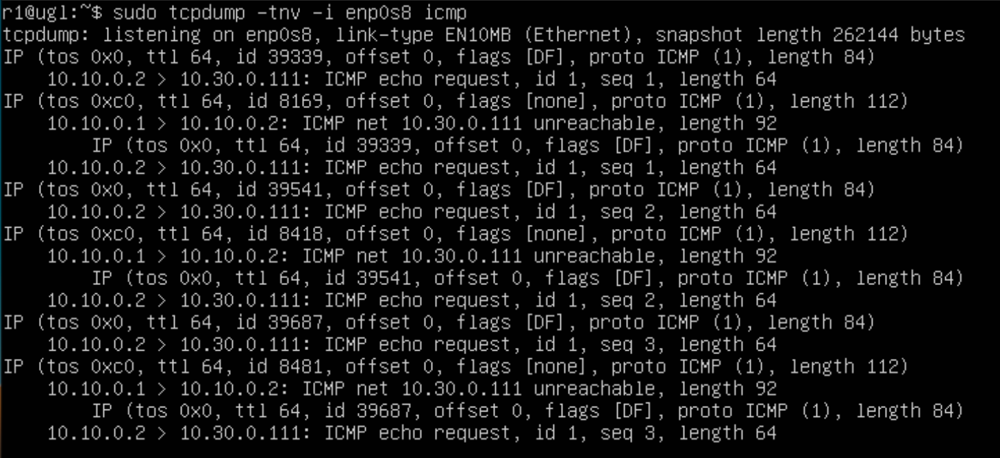  

## Part 6. Динамическая настройка IP с помощью DHCP  

- Настроем службу DHCP через файл по пути ```/etc/dhcp/dhcpd.conf```  

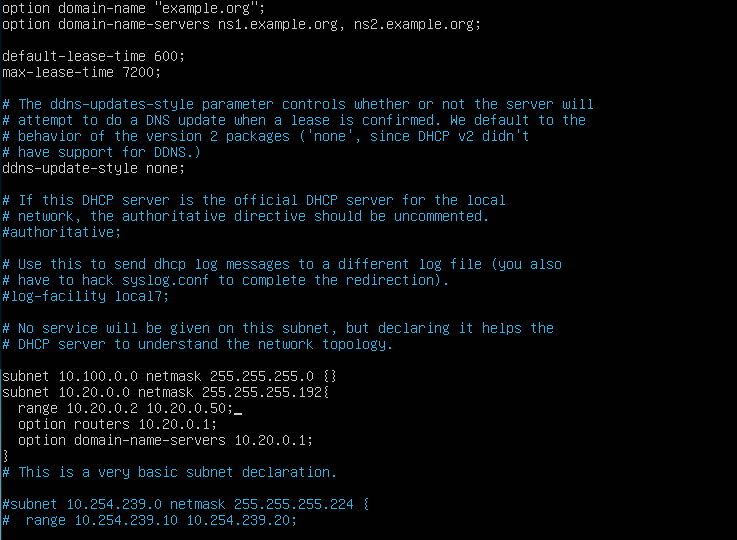  

- В файле resolv.conf пропиши nameserver 8.8.8.8.  

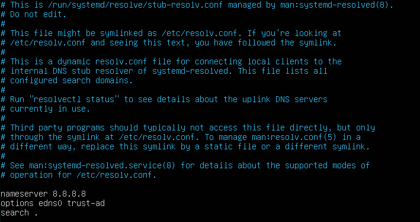  

- Проверим, что ws21 действительно выдался динамический ip  

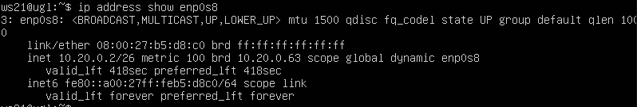  

- Пропингуем с ws22 а ws21  

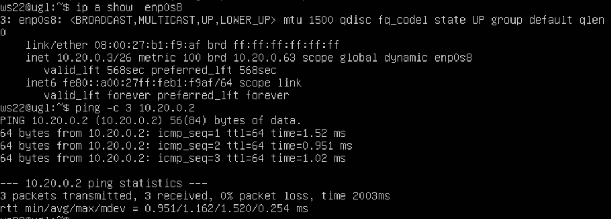  

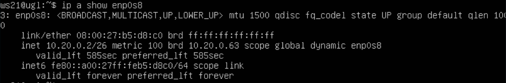  

- Указать MAC адрес у ws11, для этого в etc/netplan/00-installer-config.yaml надо добавить строки: macaddress: 10:10:10:10:10:BA, dhcp4: true  

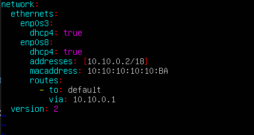  

- Настроим dhcp сервер на r1  

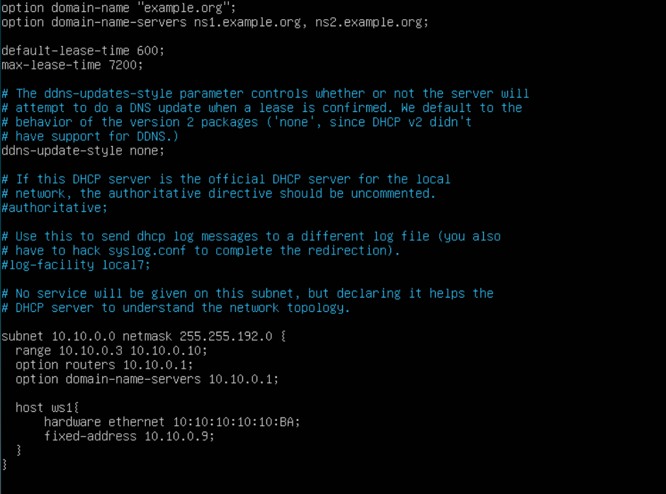  

- И dns  

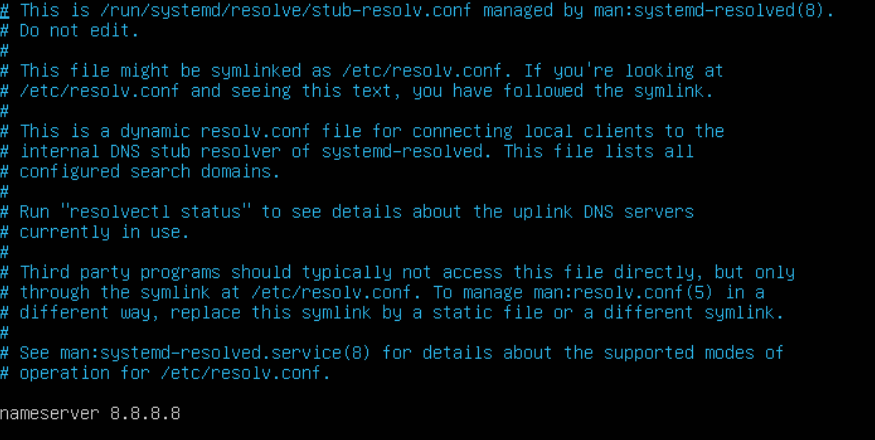  

- Обновим dhcp сервер и запустил ws11, видим что ip выдался по мак адресу  

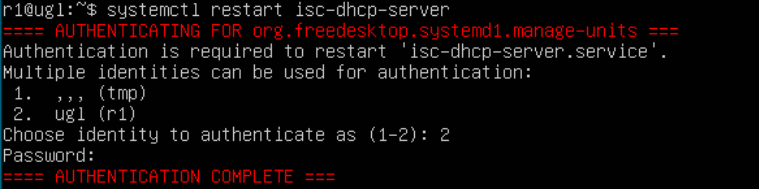  

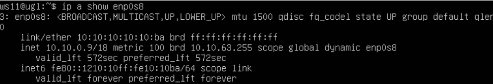  

- В отчёте помести скрины ip до и после обновления.  

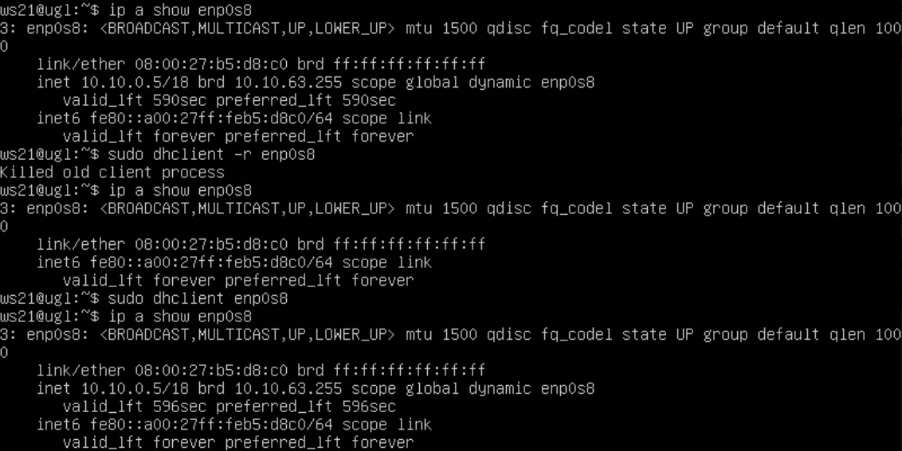  

- Команда dhclient -r enp0s8 использовалась для обновления ip адреса, полученного от dhcp - сервера

## Part 7. NAT  

- В файле /etc/apache2/ports.conf на ws22 и r1 изменить строку Listen 80 на Listen 0.0.0.0:80, то есть сделать сервер Apache2 общедоступным  

```ws22```  

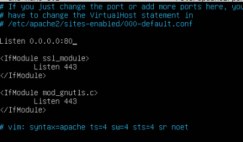

```r1```  

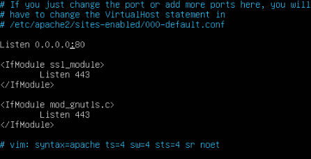

- Запустим сервера на ws22 и r2  

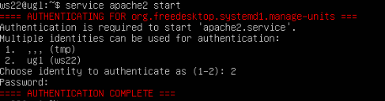  

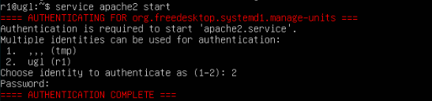  

- Добавим фаервол  

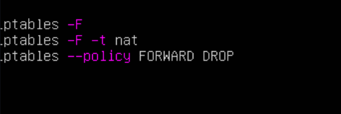  

- Проверь соединение между ws22 и r1 командой ```ping```.  

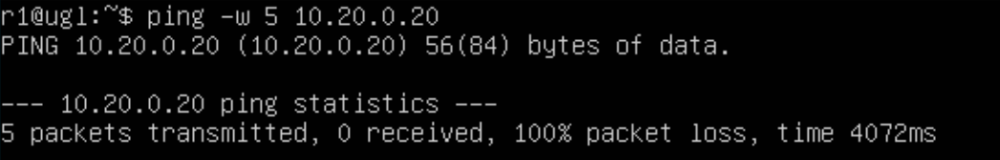  

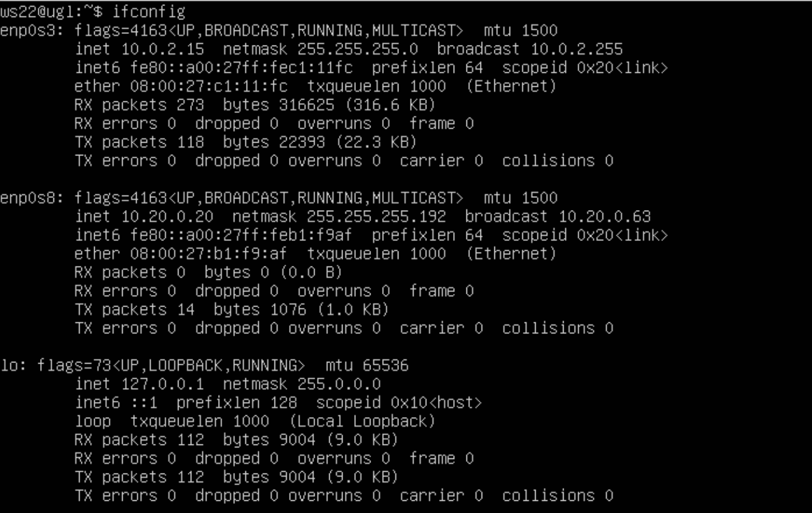  

- Разрешить маршрутизацию всех пакетов протокола ICMP  

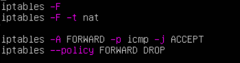  

- Проверь соединение между ws22 и r1 командой ```ping```. Как видим соеденение есть

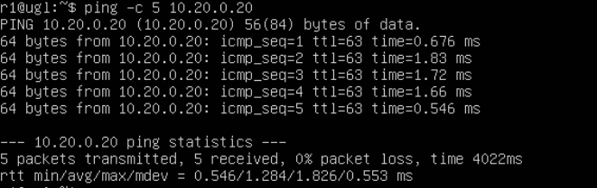  

- Добавь в файл ещё два правила  

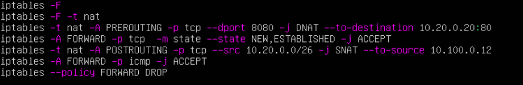  

- Проверь соединение по TCP для SNAT: для этого с ws22 подключиться к серверу Apache на r1 командой:  

```telnet [адрес] [порт]```  

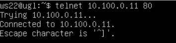  

Проверь соединение по TCP для DNAT: для этого с r1 подключиться к серверу Apache на ws22 командой ```telnet``` (обращаться по адресу r2 и порту 8080).

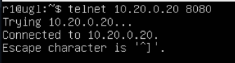