# Simple Docker  

## Part 1. Ready-made docker  

- Скачиваем официальный образ nginx ```docker pull```

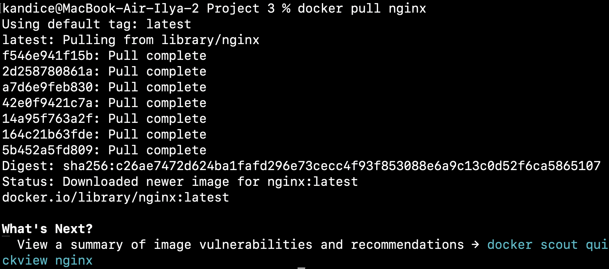  

- Проверяем, что образ скачался ```docker images | grep nginx```  

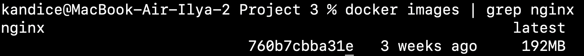  

- Запускаем образ ```docker run -d nginx```  

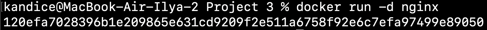  

- Удостоверимся, что контейнер успешно запустился через команду ```docker ps```  

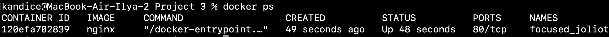  

- Посмотрим информацию о контейнере через команду ```docker inspect focused_joliot```  

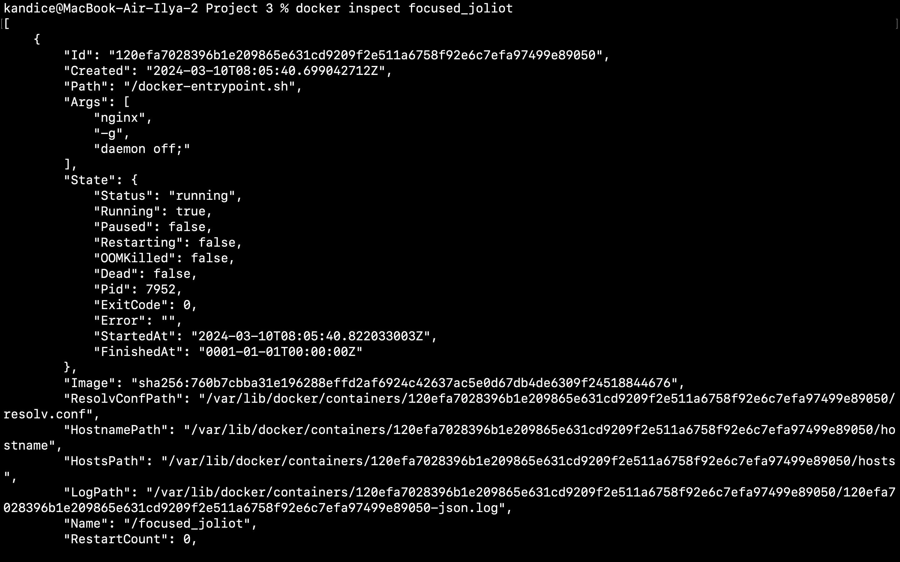  

- Выведем размер контейнера ```docker inspect focused_joliot --size | grep -ie size```  

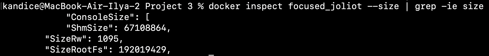  

- Cписок замапленных портов

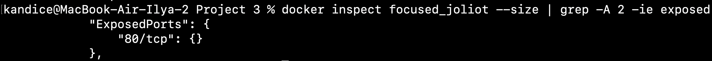  

- IP контейнера  

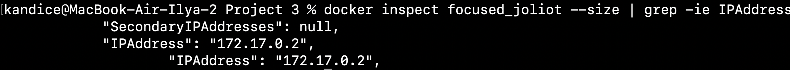  

- Остановим контейнер  

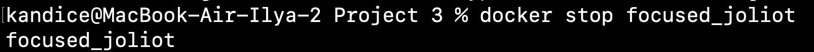  

- Проверим, что образ остановился

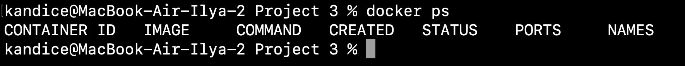  

- Запустим docker-образ с портами 80:80 и 443:443

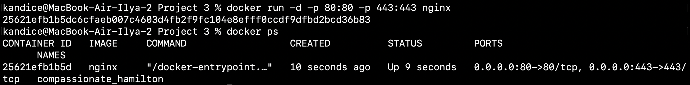  

- Проверим работоспособность

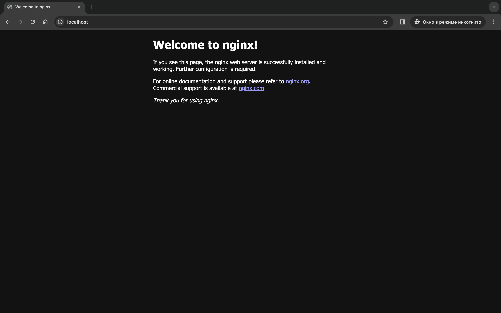  

- Перезапустим контейнер ```docekr restart```  

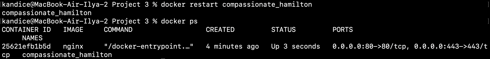  

