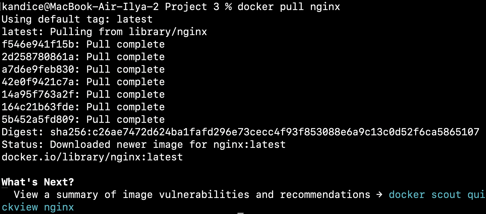

# Simple Docker

## Part 1. Ready-made docker

- Возьмём официальный docker-образ с nginx и выкачаем его при помощи команды `docker pull`  

  

- Удостоверимся в наличии образа через команду `docker images`  

  

- Запустим docker-образ через команду `docker run -d [image_id|repository]`  

  

- Удостоверимся, что контейнер успешно запустился через команду `docker ps`  

  

- Посмотрим информацию о контейнере через команду `docker inspect [container_id|container_name]`  

  

- Выведем размер контейнера  

  

- Список замапленных портов  

  

- IP контейнера  

  

- Остановим docker-образ командой `docker stop [container_id|container_name]` и проверим, что образ успешно остановился через уже знакомую команду `docker ps`  

  

- Запустим docker-образ с портами 80:80 и 443:443 чере команду `docker run`  

  

- Удостоверимся, что все работает, открыв в браузере страницу по адресу `localhost`  

  

- Перезапустим контейнер через команду `docker restart [container_id|container_name]` и проверим, что контейнер снова запустился командой `docker ps`  

  

## Part 2. Operations with container

- Прочтем конфигурационный файл `nginx.conf` внутри docker-контейнера через команду `docker exec`  

  

- Создадим локальный файл `nginx.conf` при помощи команды `touch nginx.conf` и настроем в нем выдачу страницы-статуса сервера по пути `/status`  

  

- Перенесем созданный файл внутрь docker-образа командой `docker cp`  

  

- Перезапустим nginx внутри docker-образа командой `docker exec [container_id|container_name] nginx -s reload`  

  

- Убедимся, что все работает, проверив страницу по адресу `localhost/status`  

  

- Экспортируем наш контейнер в файл `container.tar` командой `docker export`  

- Удалим образ командой `docker rmi -f [image_id|repository]`, не удаляя перед этим контейнеры  

  

- Удалим остановленный контейнер командой `docker rm [container_id|container_name]`  

  

- Импортируем контейнер обратно командой `docker import` и запустим импортированный контейнер уже знакомой командой `dicker run`  

  

- Проверим, что по адресу `localhost/status` выдается страничка со статусом сервера nginx  


## Part 3. Mini web server

- Чтобы создать свой мини веб-сервер, необходимо создать .c файл, в котором будет описана логика сервера (в нашем случае - вывод сообщения `Hello World!`), а также конфиг `nginx.conf`, который будет проксировать все запросы с порта 81 на порт 127.0.0.1:8080  

  

  

- Выкачаем новый docker-образ и на его основе запустим новый контейнер  

  

- Перекинем конфиг и логику сервера в новый контейнер  

  

- Установим требуемые утилиты для запуска мини веб-сервера на FastCGI, в частности `spawn-fcgi` и `libfcgi-dev`  

  

- Скомпилируем и запустим наш мини веб-сервер через команду `spawn-fcgi` на порту 8080  

  

- Удостовериться, что все работает корректно, проверим, что в браузере по адресу `localhost:81` отдается написанная нами страница  

  

  

## Part 4. Your own docker

- Напишем свой docker-образ, который собирает исходники 3-й части, запускает на порту `80`, после копирует внутрь написанный нами `nginx.conf` и, наконец, запускает `nginx` (ниже приведены файлы `run.sh` и `Dockerfile`, файлы `nginx.conf` и `server.c` остаются с 3-й части)  

  

  

- Соберем написанный docker-образ через команду `docker build`, при этом указав имя и тэг нашего контейнера  

  

- Запустим собранный docker-образ с мапингом порта `81` на порт `80` локальной машины, а также мапингом папки `./nginx` внутрь контейнера по адресу конфигурационных файлов nginx'а, и проверим, что страничка написанного сервера по адресу  

  

- Добавим в файл `nginx.conf` проксирование странички `/status`, по которой необходимо отдавать статус сервера `nginx  

  

- Перезапустим `nginx` в своем docker-образе командой `nginx -s reload`  

  

- Проверим, что по адресу `localhost/status` выдается страничка со тсатусом сервера `nginx`  

  

## Part 5. Dockle

- Просканируем docker-образ из предыдущего задания на предмет наличия ошибок командой `dockle [image_id|repository]`  

  

- Исправим конфигурационные файлы docker-образа так, чтобы при проверке через утилиту `dockle` не возникало ошибок и предупреждений (для Part5 я создал отдельный контейнер с тэгом `part_5`, куда подгрузил измененные конфиги)  

  

  

  

## Part6. Basic Docker Compose

- Остановим все запущенные контейнеры командой `docker stop`  

  

- Создадим ```docker-compose.yaml```

  

- Теперь сбилдим контейнер командой `docker-compose build`  

  

- После необходимо поднять сбилженный контейнер командой `docker compose up`  

  

- В завершение насладимся плодами своей усердной работы, удостоверившись, что по адресу `localhost` отдается страничка с надписью `Hello World!`  

  
